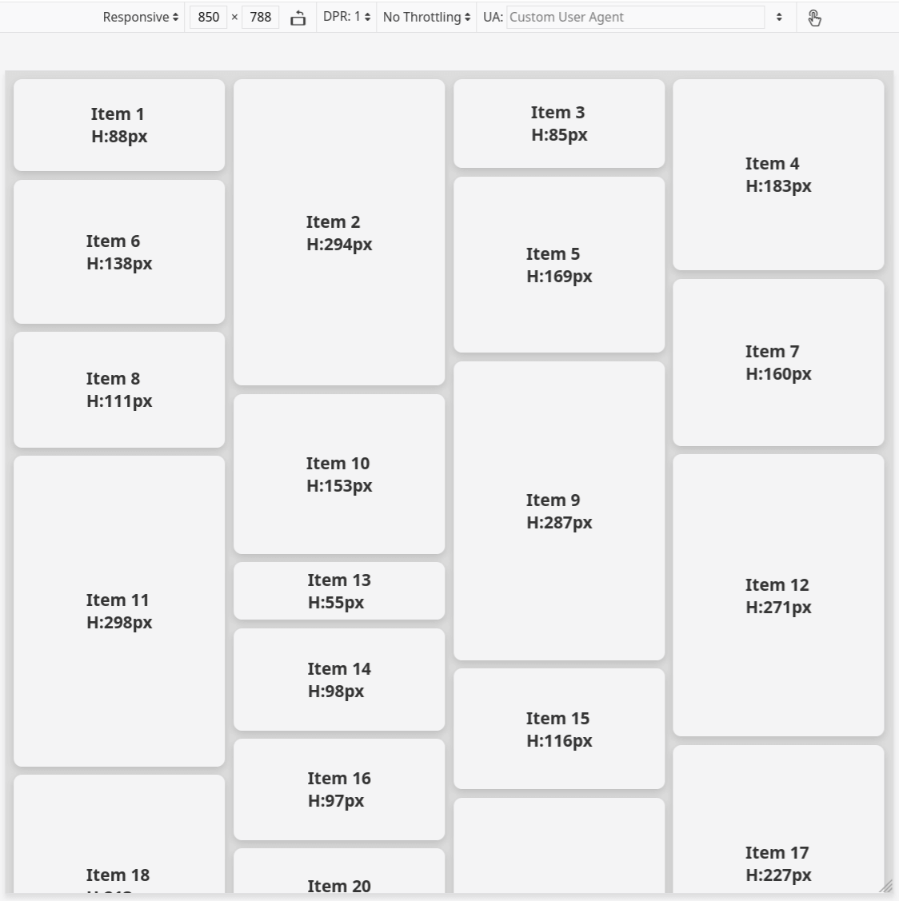

# Flex-Masonry

Diplay many images in various ratios, a mixed of square, portrait, tall, wide and panorama images.

# Requirements
1. Ordering/displaying images from LEFT to RIGHT.
2. Responsive, auto detect window resize and change column count.
3. Animate items moving to new position when column count changed.
4. Small and no dependency, tiny and pure vanilla is the most delicious.
  * DO NOT add unnecesary code for future-proof, requirements are fixed !

# Limitations
1. Only support 1 masonry container, design to display images full screen.

# CSS
Mandatory style:
if the container has id="masonry_container"

#masonry_container {
  display: flex;
  align-items: flex-start;
}

#masonry_container > * {
  flex: 1;
  display: flex;
  flex-direction: column;
  width: 0; 
}

